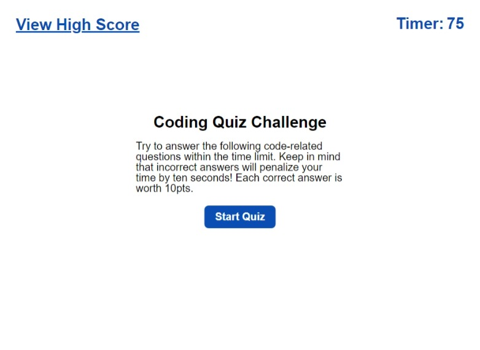

# Coding Quiz Challenge

## Webpage Description
This is a coding quiz. It is made up of seven questions, six of which are multiple choice and one that is true or false.

The code in HTML establishes "boxes" for each different screen. These are toggled between hidden and not hidden by Javascript and CSS. Some of the contents are already laid out in HTML but a majority of them are generated by JavaScript.

### Starting Box/Screen
Here the player is presented with the title of the quiz "Coding Quiz Challenge". They also are given the rules to the game. They then have the option of either start the quiz or check out the high score on their device (local storage).

### Questions Box/Screen
Once the start quiz button is pressed, the player will be presented with the quiz questions and the timer will start. For each correct answer, 10pts are logged by JavaScript. For each incorrect answer, 10 seconds are removed from the timer, putting the player at risk of not being able to answer all the questions. A display will appear below the next question for 2 seconds after each question has been answered, letting them know if they got the prevous question correct or wrong.

The game ends when either the player has answered all of the questions OR the timer hits 0.

All of the questions are loaded dynamically though JavaScript.

### End Game Box/Screen
Here the player is presented with their score and is given the option to enter their initials. The player can also choose not to log their initials and instead view the High Score Table. Initials and score are stored as an object in an array and then saved to the browser's local storage.

### High Score Table Box/Screen
Here the player is present with the high scores table. They have the option to go back and play again OR clear the high scores table.

This table is generated dynamically through Javascript, loading from localstoarge.

## Link to Website
The deployed website can be accessed [here](https://wald14.github.io/code_quiz/)

## Acknowledgements
- Gary Almes (Professor) - provided the class with ideas on how to tackle this project.
- Jose Lopez (Tutor) - helped me come up with a plan to more efficently structure my code and how to cycle through questions.
- [W3School](https://www.w3schools.com/)
- [MDN Web Docs](https://developer.mozilla.org/)

## Site Preview
The following image shares the web application's apperance:
 

